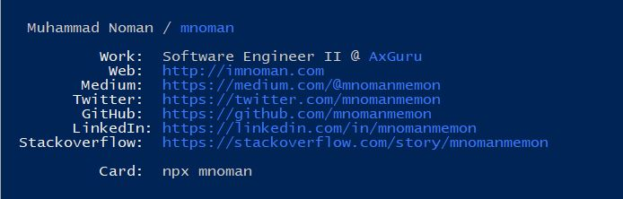

# [mnoman](https://www.npmjs.com/package/mnoman)

<center></center>

Having your own npm package is fun.

Created a [business card](https://www.npmjs.com/package/mnoman) highly inspired by [bitandbang](https://twitter.com/bitandbang)'s idea he [shared on twitter](https://twitter.com/bitandbang/status/1075473070368919552).

Usage of `colorette` inspired by [mhartington](https://github.com/mhartington) because of zero dependencies.

Run below from your terminal.
```bash
npx mnoman
```